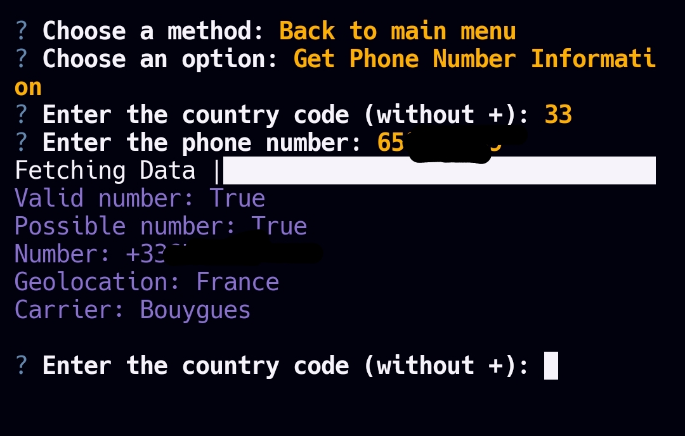
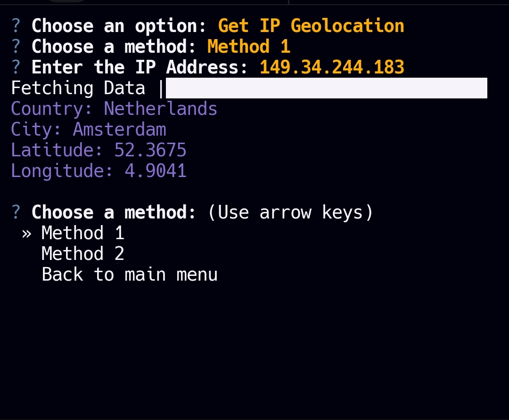

# IP-Tracker

<p align="center">

</p>

<p align="center">
<b>Advanced IP and phone number tracking and collection tool</b>
</p>

<details>
  <summary><strong>Installation and Usage</strong></summary>
  <p>

  ```sh
  git clone https://github.com/tucommenceapousser/IP-Tracker.git

  cd IP-tracker

  pip3 install -r requirements.txt

  python3 main.py
  ```

  </p>
</details>

<details>
  <summary><strong>Screenshots</strong></summary>
  <p align="center">
    
  </p>
  <p align="center">
    
  </p>
  <p align="center">
    
  </p>
</details>

<details>
  <summary><strong>Credits</strong></summary>
  <p>
    Modded by <b>trhacknon</b>
  </p>
</details>
