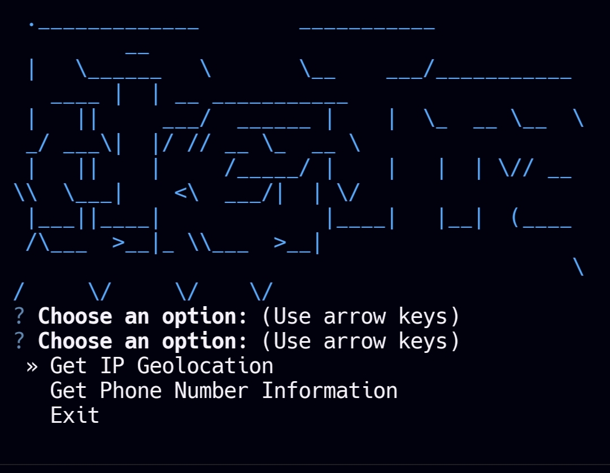

# IP-Tracker

<p align="center">

</p>

<p align="center">
<b>Advanced IP and phone number tracking and collection tool</b>
</p>

## Clone this repository on Replit

You can easily clone this repository and start coding on Replit by following these steps:

1. Go to [Replit](https://replit.com/).
2. Click on the `+` button to create a new Repl.
3. Select `Import from GitHub`.
4. Paste the following URL: `https://github.com/tucommenceapousser/ipnuminfo`.
5. Click on the `Import from GitHub` button.

Alternatively, you can click the button below to directly import and start working on the project:

[](https://repl.it/github/tucommenceapousser/ipnuminfo)

<details>
  <summary><strong>Installation and Usage</strong></summary>
  <p>

  ```sh
  git clone https://github.com/tucommenceapousser/ipnuminfo.git

  cd IP-tracker

  pip3 install -r requirements.txt

  python3 main.py
  ```

  </p>
</details>
<details>
  <summary><strong>Screenshots</strong></summary>
  <p align="center">
    
  </p>
  <p align="center">
    
  </p>
  <p align="center">
    
  </p>
</details>

<details>
  <summary><strong>Credits</strong></summary>
  <p>
    Modded by <b>trhacknon</b>
  </p>
</details>
